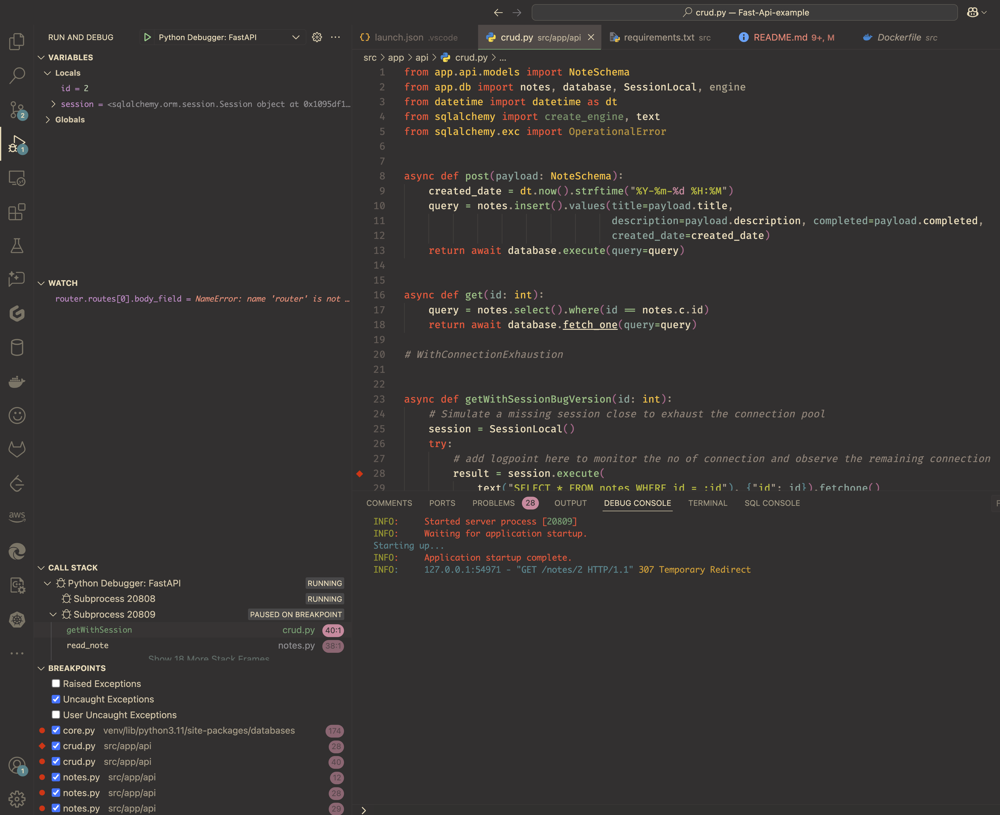

# Remote debugging FastAPI example APP with using debugpy

This repository contains FastAPI code for asynchronous example api using the [Fast Api framework](https://fastapi.tiangolo.com/) ,Uvicorn server and Postgres Database to perform crud operations on notes. (From [KenMwaura1/Fast-Api-example](https://github.com/KenMwaura1/Fast-Api-example)). And, it also contains Kubernetes resources and debugpy setup for deploying to Kubernetes and demonstrating remote debugging in Kubernetes.



## Accompanying Article

Original fastapi setup tutorial by Ken Mwaura1: [here](https://dev.to/ken_mwaura1/getting-started-with-fast-api-and-docker-515)

## Installation method 1 (Run application locally)

1. Clone this Repo

   `git clone (https://github.com/KenMwaura1/Fast-Api-example)`
2. Cd into the Fast-Api folder

   `cd Fast-Api-example`
3. Create a virtual environment

   `python3 -m venv venv`
4. Activate virtualenv

   `source venv/bin/activate`

   For zsh users

   `source venv/bin/activate.zsh`

   For bash users

   `source venv/bin/activate.bash`

   For fish users

   `source venv/bin/activate.fish`
5. Cd into the src folder

   `cd src`
6. Install the required packages

   `python -m pip install -r requirements.txt`
87. Ensure you have a Postgres Database running locally or you can setup Postgres Database on minikube and expose the service to your local (Ref: Setup Postgres SQL in minikube).
   Additionally create a `fast_api_dev` database with user `**fast_api**` having required privileges.
   OR
   Change the DATABASE_URL variable in the **.env** file inside then `app` folder to reflect database settings (user:password/db)
8. Start the app

   ```shell
   python main.py
   ```

    7b. Start the app using Uvicorn

   ```shell
   uvicorn app.main:app --reload --workers 1 --host 0.0.0.0 --port 8002
   ```

   7c. Start the app using debugger: In the sidebar, Select `Run and Debug` > Select `Python Debugger: FastAPI` > Click `Start Debugging` / Click `F5`


9. Check the app on [notes](http://localhost:8002/notes)
Open your browser and navigate to [docs](http://localhost:8002/docs) to view the swagger documentation for the api.


## Installation method 2 (Run Locally using minikube)

1. Ensure [Docker](https://docs.docker.com/install/) is installed.

2. Ensure [minikube](https://minikube.sigs.k8s.io/docs/start) is installed.

3. Ensure [kubectl](https://kubernetes.io/docs/tasks/tools/) is installed.

4. Clone this Repo

   `git clone (https://github.com/Cyril-zip/remote-debugpy-example)`

5. Change into the directory

   ```cd Fast-Api-example```

### Setup Postgres SQL in minikube

0. change directory to Kubernetes
`cd kubernetes`

1. Setup Persistent Volumes
`kubectl apply -f ./ps-pvc.yaml `

2. Setup `example` namespace, it holds our postgres sql and the FastAPI
`kubectl apply -f ./example-ns.yaml`

3. Setup Postgres SQL Persistent Volume Claim
`kubectl apply -f ./ps-svc.yaml`

4. Setup Postgres SQL configmaps
`kubectl apply -f ./ps-configmap.yaml`

5. Setup Postgres SQL secret
`kubectl apply -f ./ps-secret.yaml`

6. Setup Postgres SQL statefulset
`kubectl apply -f ./ps-statefulset.yaml`

7. Setup Postgres SQL svc
`kubectl apply -f ./ps-svc.yaml`

8. Expose Postgres SQL svc to local (Optional, For local development only)
`kubectl port-forward svc/postgres 5432:5432 -n example`

### Setup Fastapi example app

0. Change directory to `src` folder

1. Build the docker image and provide the version tag
`docker build -f ./Dockerfile -t testing/fast-api-example:<tag> .`

2. Push the image to minikube internal registry
`minikube image load testing/fast-api-example:<tag>`

3. Replace your image url in the deployment

4. Change directory to `kubernetes` folder

5. Setup the fastapi deployment
`kubectl apply -f ./fast-api-deployment.yaml`

6. setup fastapi clusterIP svc to expose service
    a. setup fastapi clusterIP svc to expose service
    `kubectl apply -f ./fast-api-svc.yaml`

    b. Expose fastapi svc to local (Optional, For local development only)
    `kubectl port-forward svc/fast-api-svc <localhost_port>:<container_port> -n example`

7. Or setup fastapi load balancer svc to expose service
    a. setup fastapi svc to expose service
    `kubectl expose deployment fast-api-deployment -n example --type=LoadBalancer --port=<port>`

    b. Expose fastapi load balancer svc to local (For local development only)
    `minikube tunnel`

## Setup the Remote debugger

1. Use `kubectl-patch-enable-debugpy.sh` to start `debugpy` server in fastapi
`./kubectl-patch-enable-debugpy.sh`
2. Setup kubectl port forwarding:
`kubectl port-forward pod/<pod-name> <localhost_port>:<container_port> -n example`

## Tests

Tests are available using pytest
Run them using `pytest .` while in the root directory (/Fast-Api-example)

## Documentation

Open API Documentation is provided by [Redoc](http://localhost:8002/redoc)


## License

[MIT](https://choosealicense.com/licenses/mit/)
